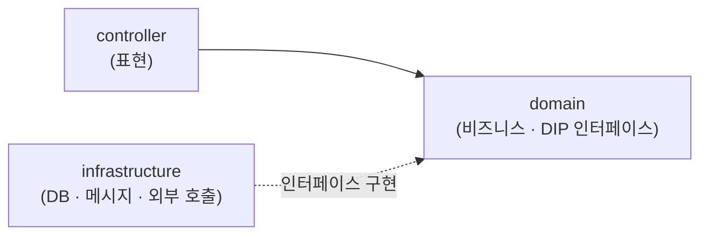
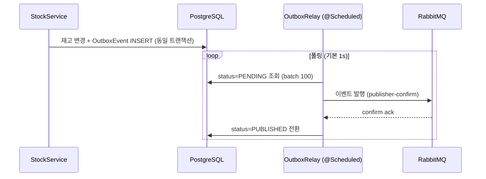

# Inventory Service

> MSA 기반 자동차 부품 유통 ERP의 **재고(Inventory) 마이크로서비스**. 창고·재고 관리와 입출고 이력을 담당하며, **트랜잭션 아웃박스 패턴**으로 구매(Procurement)·판매(Sales) 서비스와 이벤트 기반으로 연동합니다.


## 개요

국내 자동차 부품 유통(본사 1개소 + 직영 지점 약 80개소, 연 약 12,000 SKU, 월 입출고 약 5만 건)을 위한 MSA ERP의 **재고 서비스**입니다. 전체 시스템은 Auth · User · Item · **Inventory** · Procurement · Sales 6개 서비스로 구성됩니다.

핵심 목표는 **데이터 정합성과 빠른 응답, 서비스 간 장애 격리, 외부 호출 실패 시 명확한 에러 응답과 재시도**입니다.

## 기술 스택

- **Framework**: Java 21, Spring Boot 4.0.6 (WebMVC, Data JPA, Validation, Security)
- **Database**: PostgreSQL 16 (테스트: H2)
- **Messaging**: RabbitMQ 3.13 (Spring AMQP, Publisher Confirm, DLQ)
- **Auth**: OAuth2 Resource Server (Keycloak JWT)
- **Docs / Build / CI·CD**: springdoc-openapi, Gradle, Docker, Jenkins, Harbor Registry

## 아키텍처

DIP(의존성 역전)를 적용한 레이어드 아키텍처. 영속성·외부 통신을 도메인이 정의한 인터페이스로 추상화해 도메인이 기술에 의존하지 않도록 설계했습니다.



`controller`는 `domain`에 의존하고, `infrastructure`는 `domain`이 정의한 인터페이스를 구현합니다(의존성 역전). 도메인 모델·인터페이스에는 프레임워크 의존을 두지 않습니다.

## 핵심 기능

- **창고/지점 관리**: 본사(HQ)·지점(BRANCH) 창고 마스터, 코드 유일성 검증, 활성/비활성 토글
- **재고 관리**: (SKU × 창고) 단위 현재고·안전재고, 아이템명/단위 비정규화 미러링
- **입출고 처리**: 구매 입고·판매 출고를 이벤트로 수신, 멱등 처리 + 추가전용(append-only) 이동 이력
- **재고 조정**: 사유 코드 기반 수동 조정, 음수 재고 방지
- **아이템 동기화**: Item 서비스 스냅샷 이벤트로 이름/단위/활성 상태 동기화
- **KPI 집계**: 안전재고 미달 집계, 최근 7일 이동 건수, 일자별 이동 차트 (권한별 창고 범위)

### 이벤트 기반 아키텍처 (Transactional Outbox / Inbox)

비즈니스 변경과 이벤트 발행의 원자성을 아웃박스 패턴으로 보장합니다.



- **아웃박스**: 브로커 수신 확정(publisher confirm) 후에만 `PUBLISHED`로 전환 → at-least-once 보장
- **3중 멱등성**: `eventId`(메시지) + 아웃박스 유니크 키 + `stock_movement(source_ref, source_line_no, warehouse_id)`(비즈니스)
- **재시도 / DLQ**: 기술 실패는 백오프 재시도(1s→10s, 3회) 후 DLX로, 비즈니스 실패는 재시도 없이 거부 이벤트로 번역
- **하우스키핑**: 매일 새벽 4시(KST) PUBLISHED/PROCESSED 이력 정리(보존 3일)

## 동시성 & 정합성

| 메커니즘 | 적용 위치 | 결과 |
| --- | --- | --- |
| 비관적 쓰기 락 (lock timeout 3s) | 입·출고 시 재고 행 | 음수 재고 경쟁 방지, 초과 시 `409 LOCK_TIMEOUT` |
| 낙관적 락 (`@Version`) | 재고·창고 수정 | 동시 수정 충돌 시 `409 OPTIMISTIC_LOCK_CONFLICT` |
| DB 제약 (`@Check`, `UNIQUE`) | 재고/이동이력 | 음수·중복을 DB 레벨에서 차단 |

## API

- **Base**: `/inventory/**`(공개) · `/internal/inventory/**`(서비스 간 내부)
- **Swagger UI**: `/inventory/swagger-ui.html` · **Health**: `GET /inventory/health`

| 리소스 | 대표 엔드포인트 |
| --- | --- |
| 창고 (`/inventory/warehouses`) | `GET` 목록 · `GET /hq` · `GET /options` · `POST` · `GET /code-check` · `GET`·`PUT /{code}` · `PATCH /{code}/active` |
| 지점 (`/inventory/branch-locations`) | `POST` · `GET` · `GET /unassigned` |
| 재고 (`/inventory/stocks`) | `GET` 목록 · `GET /{warehouseCode}/{sku}` · `POST` · `GET /kpi` · `POST /adjustments` · `GET`·`PATCH /{warehouseCode}/{sku}/safety-stock` |
| 재고 수량 (`/inventory/stocks/quantities`) | `GET` (최대 50 SKU 배치) |
| 이동 이력 (`/inventory/stocks/movements`) | `GET` 목록 · `GET /summary` |
| 내부 (`/internal/inventory`) | `PATCH /items/{sku}/{name,unit,active}` · `GET /warehouses/{code}` · `POST /stocks/{inbound,outbound}` |

## 보안 & 예외 처리

- **인증**: OAuth2 Resource Server, Keycloak 발급 JWT를 `issuer-uri` OIDC 디스커버리로 검증(Stateless)
- **인가**: 역할(`ADMIN`, `HQ_MANAGER`, `HQ_STAFF`, `BRANCH_MANAGER`, `BRANCH_STAFF`) + 테넌시 행 단위 스코프(BRANCH는 자기 창고만)
- **에러 응답**: RFC 9457 `ProblemDetail`(`errorCode`·`timestamp` 부가), HTTP 변환은 `GlobalExceptionHandler` 한 곳

## 프로젝트 구조

```text
com.fallguys.inventoryservice
├── stock              # 재고 애그리거트 (재고/입출고/조정/KPI/이동이력/동기화)
├── warehouse          # 창고 마스터
├── branchlocation     # 지점 위치
├── messaging          # RabbitMQ 토폴로지 · 아웃박스/인박스 · 릴레이 · 컨슈머 · 스케줄러
├── shared             # 공통 예외 핸들러 · 보안 · 쿼리/페이징 모델
└── config             # JPA Auditing 등 설정
```

각 애그리거트는 `controller` / `domain` / `infrastructure` 3계층으로 구성됩니다.

## 로컬 실행

**요구 사항**: JDK 21, Docker

```bash
docker-compose up -d          # RabbitMQ + PostgreSQL 기동
export DB_PASSWORD=postgres   # 필수 (그 외 항목은 기본값 사용)
./gradlew bootRun
```

- 앱: `http://localhost:8080` · Swagger: `/inventory/swagger-ui.html` · Health: `/inventory/health`
- 주요 환경변수: `DB_HOST/PORT/NAME/USERNAME/PASSWORD`, `RABBITMQ_HOST/PORT`, `KEYCLOAK_ISSUER_URI`, `INVENTORY_MESSAGING_ASYNC_ENABLED`(기본 false), `ITEM_INTEGRATION_ENABLED`(기본 false)

> 기본값(`async-enabled=false`)에서는 브로커 없이 동기 컨트롤러만으로 기동·테스트가 가능합니다.

## 테스트

```bash
./gradlew test
```

DIP 인터페이스를 In-memory Fake로 대체한 서비스 단위 테스트 + 슬라이스 테스트(`@WebMvcTest`, `@DataJpaTest`). 멱등성·락·아웃박스 릴레이·컨슈머 분기·스케줄러까지 커버합니다.

## CI/CD

`Jenkinsfile` 파이프라인: 비-`main` 브랜치는 Docker 빌드로 PR 게이트, `main`은 이미지 빌드 → Harbor Registry 푸시 → SSH `docker compose up -d --no-deps` 무중단 재배포 → 헬스체크. `Dockerfile`은 `gradle:8-jdk21-alpine` → `eclipse-temurin:21-jre-alpine` 멀티스테이지입니다.
